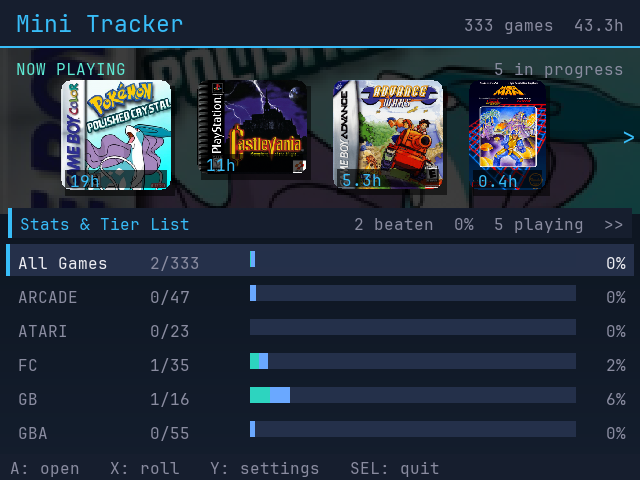
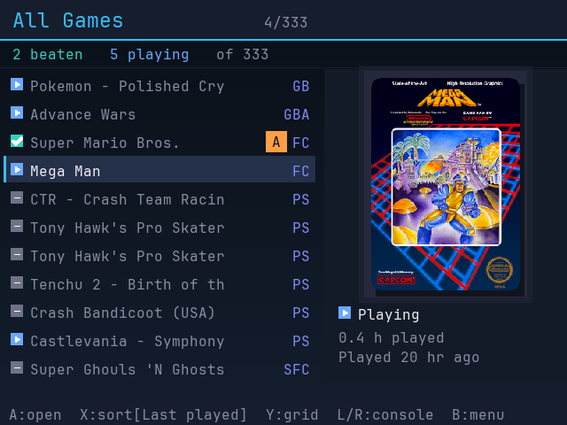
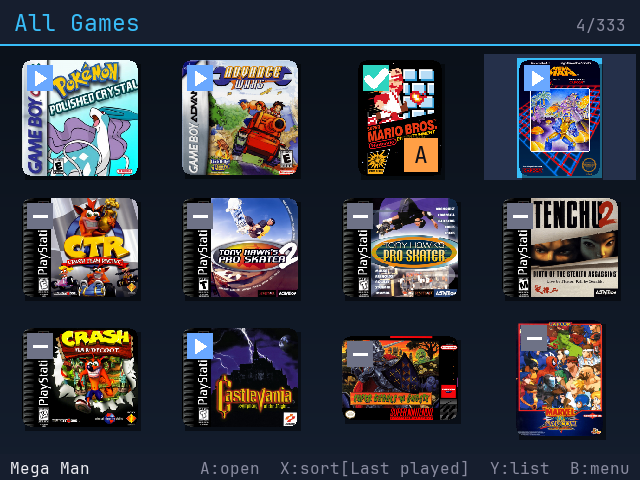
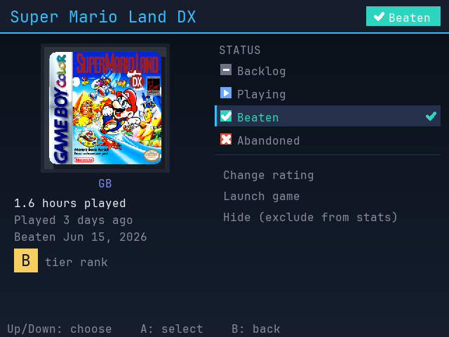
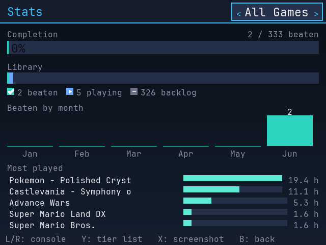
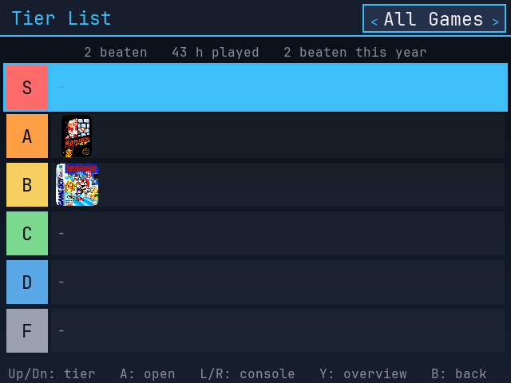

<p align="center">
  
</p>

<h1 align="center">Mini Tracker</h1>

<p align="center"><b>Track. Beat. Collect.</b></p>

<p align="center">
  A backlog tracker for <b>OnionOS</b> that runs on the handheld itself. No PC, no spreadsheet.
</p>

<p align="center">
  
  
  
  <br>
  
  
  
</p>

Mark a game Backlog, Playing, Beaten, or Abandoned. Rank the ones you finish into an S–F tier
list. Watch your completion stats fill in as you play. That's the core of it — there's more in
there once you start using it.

It's a single static ARM binary (no SDL, no dependencies). It reads your ROM library and the
play-activity OnionOS already records, **read-only**, and keeps your own data in a separate file.
It never touches firmware or OnionOS's data, and **uninstalling is deleting one folder.**

## What it does

- **Status tracking** — Backlog / Playing / Beaten / Abandoned, one button each.
- **Tier list** — rank beaten games S through F, overall or per console, and drill into any tier.
- **Stats** — completion %, library breakdown, beaten-by-month, most-played.
- **Now Playing** — your in-progress games up front, launch straight into them.
- **Box art** — grid or list view, with curated names and art from OnionOS where you have them.

Plus a few things worth finding on your own.

## Devices

Built and tested on the **Miyoo Mini Plus** (OnionOS). It should run fine on the original
**Miyoo Mini** and **Mini V4** since they share the same 640×480 screen and firmware — I just
haven't tested those, so no promises. **OnionOS is required**; other firmwares aren't supported.

The 2024 Miyoo Mini (752×560) launches, but the layout is built for 640×480 and won't fill the
bigger screen yet.

## Install

1. Download the latest `MiniTracker.zip` from [**Releases**](../../releases).
2. Put the SD card in your computer (or use FTP/SSH).
3. Copy the `MiniTracker` folder into the card's `App/` directory:
   ```
   SDCARD/App/MiniTracker/
   ```
4. Eject, reinsert, and reboot if it doesn't show up.
5. Open the **Apps** tab and launch **Mini Tracker**. First launch scans your library, so give it
   a couple of seconds.

## Notes & caveats

- **Box art is optional.** With art, the grid view looks great; without it, switch to list view
  (Settings → Default view) for a clean look. The app picks a sensible default on first run.
- **Names and art** come from each system's `miyoogamelist.xml` when present, so your library reads
  like the OnionOS menus.
- **Playtime and stats** are pulled from OnionOS's own play log, so they fill in over time as you
  actually play.
- **Launching** goes through OnionOS, so games show up in recents / GameSwitcher. A few standalone
  PORTS or `.sh` "games" track and rank fine but may not launch from here.
- **Favorites sync (optional, off by default).** OnionOS keeps a *Favorites* list on its home screen
  for quick-launching games. Turn this on and Mini Tracker keeps that list matched to whatever you've
  marked **Playing**, so your in-progress games are always a tap away from the system menu. The first
  time you enable it, it backs up your existing `favourite.json` (to `.bak`) before making any change,
  and it only ever adds or removes Favorites — it never edits your statuses, tiers, or anything else.

## Controls

| Where | Buttons |
|---|---|
| **Home** | D-pad move · **A** open · **X** random pick · **Y** settings · **Up** Now Playing strip · **SELECT** quit |
| **List / Grid** | **A** open · **X** sort · **Y** grid/list · **L/R** change console · **B** back |
| **Game page** | D-pad pick action · **A** set status / rank / launch · **B** back |
| **Stats** | **Up/Down** tier · **A** drill in · **L/R** console · **Y** Tier List ↔ Overview · **X** screenshot · **B** back |

## Safety

Mini Tracker only ever reads OnionOS data (it snapshots the play-activity DB, never writes it) and
stores your status and ranks in its own `tracker.sqlite`. The one thing it can write outside its own
folder is `favourite.json`, and only if you opt into favorites sync. No network, no telemetry, no
firmware changes. To remove it, delete `SDCARD/App/MiniTracker/` (and `SDCARD/Saves/<profile>/MiniTracker/`
for a clean slate).

## Build from source

Cross-compiles to a fully-static musl ARMv7 binary (SQLite, stb_image, and the font are compiled in):

```sh
make gui      # -> minitracker.arm ; copy into dist/App/MiniTracker/minitracker
```

You need the `armv7-unknown-linux-musleabihf` toolchain (e.g. Homebrew `messense/macos-cross-toolchains`).
See [`docs/FEATURES.md`](docs/FEATURES.md) for a full feature tour.

## License

MIT (see [`LICENSE`](LICENSE)). Bundles SQLite (public domain), stb_image (public domain), and
JetBrains Mono (SIL OFL); see [`THIRD_PARTY.md`](THIRD_PARTY.md). Built for the OnionOS / Miyoo Mini
community, not affiliated with Miyoo or the OnionOS team.
